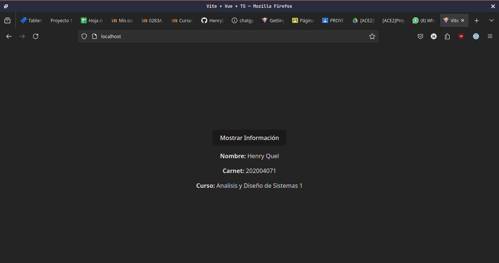

# Tarea 2 - Docker

Se creo una pagina web sencilla usando Vue.js y se creo un Dockerfile para empaquetar la aplicacion en un contenedor de Docker.

## Instrucciones para ejecutar la aplicacion

1. Construir la imagen de Docker

   ```bash
   docker build -t vue-app .
   ```

2. Ejecutar el contenedor

   ```bash
   docker run -d -p 80:80 vue-app
   ```

3. Acceder a la aplicacion en el navegador

   ```bash
   http://localhost
   ```

## Dockerfile

```Dockerfile
FROM node:18-alpine AS build-stage

WORKDIR /app

COPY package*.json ./

RUN npm install -g typescript vue-tsc

COPY . .

RUN npm run build

FROM nginx:1.21.3-alpine as production-stage

COPY --from=build-stage /app/dist /usr/share/nginx/html

EXPOSE 80

CMD ["nginx", "-g", "daemon off;"]
```

Este dockerfile lo que hace es obtener una imagen de node con la version 18 y alpine como sistema operativo, luego se copian los archivos necesarios para instalar las dependencias y se ejecuta el comando `npm run build` para compilar la aplicacion. Luego se obtiene una imagen de nginx con la version 1.21.3 y alpine como sistema operativo, se copian los archivos compilados de la aplicacion y se expone el puerto 80 para acceder a la aplicacion.

## Imagenes de la aplicacion


